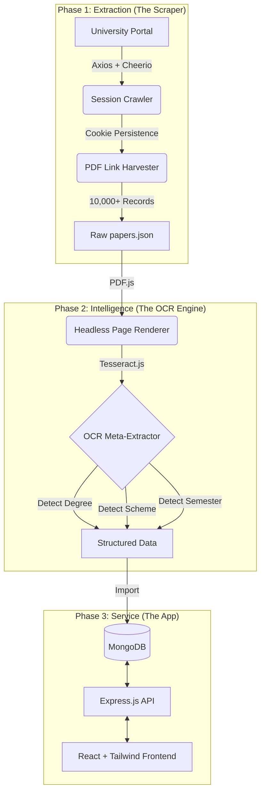

# 🎓 PyQ Platform: Automated Academic Extraction Engine

[](https://opensource.org/licenses/MIT)
[](https://nodejs.org/)
[](https://reactjs.org/)
[](https://www.mongodb.com/)

> **The ultimate bridge between legacy university archives and modern student needs.** 

PyQ Platform is a high-performance **End-to-End ETL (Extract, Transform, Load) & Discovery Engine** designed to programmatically aggregate, classify, and serve university question papers. It replaces manual, fragmented archives with a unified, searchable, and intelligent repository of **10,000+ academic resources**.

---

## 🚀 The Challenge
University portals often store critical exam materials in "flat" directory structures with:
- ❌ **No Searchability:** Users must navigate complex, session-based folders.
- ❌ **Unstructured Metadata:** Files are named inconsistently (e.g., `1234.pdf` vs `MAT101.pdf`).
- ❌ **Poor Accessibility:** Legacy servers with frequent timeouts and no mobile optimization.

**PyQ Platform solves this via an automated ingestion pipeline that "reads" the papers for you.**

---

## 🏗 System Architecture



---

## 🛠 Tech Stack

| Layer | Technologies |
| :--- | :--- |
| **Frontend** | React 18, Vite, Tailwind CSS v4, Lucide Icons |
| **Backend** | Node.js, Express, Mongoose |
| **Database** | MongoDB (Atlas / Local) |
| **Data Engineering** | Cheerio (Scraping), Tesseract.js (OCR), PDF.js (Rendering) |
| **Environment** | Dotenv, Nodemon, NPM Workspaces |

---

## 🧬 Data Pipeline Deep-Dive

### 1. High-Resilience Scraping
The scraper implements a **Retry-with-Backoff** strategy and **Cookie Jar support** to handle legacy server instability. It programmatically navigates 26+ alphabetized session indexes (A-Z) for every academic year.

### 2. Intelligent OCR Classification
Unlike basic link-trackers, the platform downloads every PDF and uses **Optical Character Recognition** to extract:
- **Degree:** (B.Tech, M.Tech, BCA, MCA)
- **Scheme:** (A-Scheme, B-Scheme, C-Scheme)
- **Semester:** (1st to 8th) using regex-based semantic matching across OCR text fragments.

### 3. Batch & Checkpoint System
Processing 10,000+ records is memory-intensive. The pipeline uses:
- **Batch Processing:** Processes papers in chunks of 4 to prevent CPU throttling.
- **Checkpointing:** Saves state to `checkpoint.txt` to allow resuming after interruptions.
- **Garbage Collection:** Manual triggers to ensure stable memory consumption during heavy PDF rendering.

---

## 📊 Project Metrics

- **Total Documents Index:** 10,264+
- **Database Size:** ~3.8MB (Normalized Metadata)
- **Search Latency:** < 50ms (Indexed MongoDB Queries)
- **Data Coverage:** 100% of available DCRUST Portal sessions since 2018.

---

## 🚦 Getting Started

### Prerequisites
- Node.js (v18+)
- MongoDB (Running locally or via Atlas)

### Installation

1. **Clone the Repo**
   ```bash
   git clone https://github.com/yourusername/pyq-platform.git
   cd pyq-platform
   ```

2. **Backend Setup**
   ```bash
   cd server
   npm install
   # Create .env with MONGO_URI and PORT
   npm start
   ```

3. **Frontend Setup**
   ```bash
   cd client
   npm install
   npm run dev
   ```

4. **Data Pipeline (Optional)**
   ```bash
   cd scripts
   npm install
   npm run scrape     # Step 1: Scrape links
   npm run normalize  # Step 2: OCR & Extract Metadata
   npm run import     # Step 3: Insert to MongoDB
   ```

---

## 📸 Interface Preview

*(Add high-resolution screenshots here of your beautiful Tailwind UI)*

---

## 📄 License
This project is licensed under the MIT License - see the `LICENSE` file for details.

---

<p align="center">
  Built with ❤️ for the student community.
</p>
